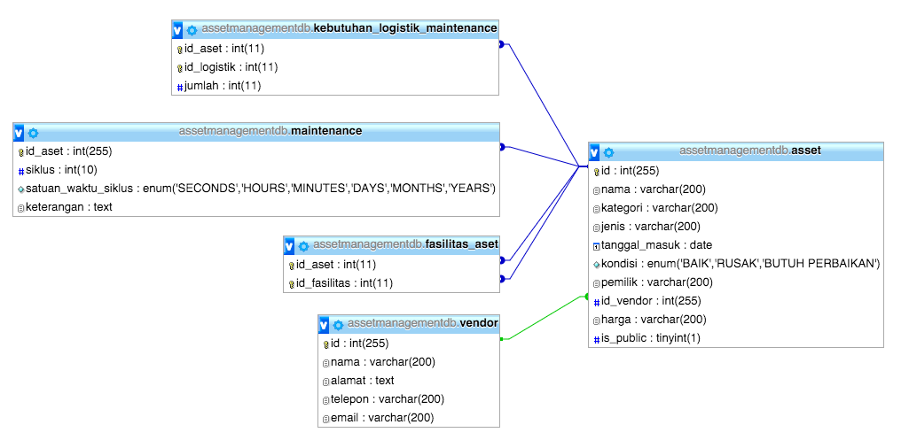

# Endpoint Documentation

## DB Schema

## Tipe Data
1. Asset
    - `int` id
    - `String` nama
    - `String` kategori
    - `Date` tanggalMasuk
    - `AssetCondition` kondisi
    - `String` pemilik
    - `Vendor` vendor
    - `String` harga
    - `boolean` publicAsset
2. Vendor
    - `int` id
    - `String` nama
    - `String` alamat
    - `String` telepon
    - `String` email
3. MaintenanceCycleTimeUnit **`Enum`**
	- `SECONDS` 
	- `MINUTES`
	- `HOURS`
	- `DAYS`
	- `MONTHS`
	- `YEARS`
4. AssetCondtition **`Enum`**
	- `BAIK` 
	- `RUSAK`
	- `BUTUH_PERBAIKAN`
5. Response
	- `boolean` success
	- `Object` returnValue

## Endpoint Service

- [registerAset](#registerAset)  
Melakukan entry aset baru ke database  
- [insertJadwalMaintenance](#insertJadwalMaintenance)  
Melakukan entry jadwal maintenance suatu aset ke ke database  
- [registerVendor](#registerVendor)  
Melakukan entry vendor baru ke database  
- [deleteAsset](#deleteAsset)  
Menghapus entry suatu aset dari database    
- [setNamaAset](#setNamaAset)  
Mengupdate `nama` dari suatu aset  
- [setPemilikAset](#setPemilikAset)  
Mengupdate `pemilik` dari suatu aset  
- [setKondisiAset](#setKondisiAset)  
Mengupdate `kondisi` dari suatu aset  
- [setJenisAset](#setJenisAset)  
Mengupdate `jenis` dari suatu aset  
- [insertKebutuhanMaintenance](#insertKebutuhanMaintenance)  
Menambahkan daftar kebutuhan logistik untuk maintenance suatu aset
- [insertFasilitasAset](#insertFasilitasAset)  
Menambahkan daftar fasilitas yang dimiliki oleh suatu aset
- [getAset](#getAset)   
Mengambil data suatu aset berdasarkan id-nya
- [getAsetByKategori](#getAsetByKategori)   
Mengambil daftar aset-aset yang memiliki tertentu
- [getAsetByNama](#getAsetByNama)   
Mengambil data suatu aset berdasarkan namanya
- [getAsetByJenis](#getAsetByJenis)   
Mengambil daftar aset-aset yang memiliki jenis tertentu
- [getFasilitasAset](#getFasilitasAset)   
Mengambil daftar aset-aset yang menjadi fasilitas dari suatu aset
- [notifyMaintenanceToVendor](#notifyMaintenanceToVendor)   
Mengirimkan notifikasi email untuk maintenance suatu aset kepada vendornya

## Endpoint Service Detail

### <a name="registerAset">registerAset</a>
- Required parameter:   
	1. `String` nama  
	2. `String` kategori
	3. `String` jenis  
	4. `AssetCondition` kondisi  
	5. `String` pemilik  
	6. `String` idVendor  
	7. `String` harga  
	8. `boolean` isPublic
- Return type	: `Response`
- Return value :   
	- on success: `response.isSuccess()` will return `true`  
	- on failed: `response.isSuccess()` will return `false`   
	
	
### <a name="insertJadwalMaintenance">insertJadwalMaintenance</a>
- Required parameter: 
	1. `int` idAset
	2. `int` siklus
	3. `MaintenanceCycleTimeUnit` timeUnit
	4. `String` keterangan
- Return type	: `Response`
- Return value :   
	- on success: `response.isSuccess()` will return `true`  
	- on failed: `response.isSuccess()` will return `false`   
	
### <a name="registerVendor">registerVendor</a>
- Required parameter: 
	1. `String` nama
	2. `String` alamat
	3. `String` telepon
	4. `String` email
- Return type	: `Response`
- Return value :   
	- on success: `response.isSuccess()` will return `true`  
	- on failed: `response.isSuccess()` will return `false`
	
### <a name="deleteAset">deleteAset</a>
- Required parameter: 
	1. `int` idAset
- Return type	: `Response`
- Return value :   
	- on success: `response.isSuccess()` will return `true`  
	- on failed: `response.isSuccess()` will return `false`   
	
### <a name="setNamaAset">setNamaAset</a>
- Required parameter: 
	1. `int` idAset
	2. `String` nama
- Return type	: `Response`
- Return value :   
	- on success: `response.isSuccess()` will return `true`  
	- on failed: `response.isSuccess()` will return `false`   	
### <a name="setPemilikAset">setPemilikAset</a>
- Required parameter: 
	1. `int` idAset
	2. `String` pemilik
- Return type	: `Response`
- Return value :   
	- on success: `response.isSuccess()` will return `true`  
	- on failed: `response.isSuccess()` will return `false` 

### <a name="setKondisiAset">setKondisiAset</a>
- Required parameter: 
	1. `int` idAset
	2. `AssetCondition` kondisi
- Return type	: `Response`
- Return value :   
	- on success: `response.isSuccess()` will return `true`  
	- on failed: `response.isSuccess()` will return `false` 
	
### <a name="setJenisAset">setJenisAset</a>
- Required parameter: 
	1. `int` idAset
	2. `String` jenis
- Return type	: `Response`
- Return value :   
	- on success: `response.isSuccess()` will return `true`  
	- on failed: `response.isSuccess()` will return `false` 
	
### <a name="insertKebutuhanMaintenance">insertKebutuhanMaintenance</a>
- Required parameter: 
	1. `int` idAset
	2. `List<Integer>` idLogistik
	3. `List<Integer>` jumlahKebutuhan
- Return type	: `Response`
- Return value :   
	- on success: `response.isSuccess()` will return `true`  
	- on failed: `response.isSuccess()` will return `false` 
	
### <a name="insertFasilitasAset">insertFasilitasAset</a>
- Required parameter: 
	1. `int` idAset
	2. `List<Integer>` idFasilitas
- Return type	: `Response`
- Return value :   
	- on success: `response.isSuccess()` will return `true`  
	- on failed: `response.isSuccess()` will return `false` 
	
### <a name="getAset">getAset</a>
- Required parameter: 
	1. `int` idAset
- Return type	: `Asset`
- Return value :   
	- on success: not `null`  
	- on failed: `null` 

### <a name="getAsetByKategori">getAsetByKategori</a>
- Required parameter: 
	1. `String` kategori
- Return type	: `List<Asset>`
- Return value :   
	- on success: not `null`
	- on failed: `null`

### <a name="getAsetByNama">getAsetByNama</a>
- Required parameter: 
	1. `String` nama
- Return type	: `Asset`
- Return value :   
	- on success: not `null`  
	- on failed: `null` 

### <a name="getAsetByJenis">getAsetByJenis</a>
- Required parameter: 
	1. `String` jenis
- Return type	: `List<Asset>`
- Return value :   
	- on success: not `null`
	- on failed: `null`

### <a name="getFasilitasAset">getFasilitasAset</a>
- Required parameter: 
	1. `int` idAset
- Return type	: `List<Asset>`
- Return value :   
	- on success: not `null`
	- on failed: `null`

### <a name="notifyMaintenanceToVendor">notifyMaintenanceToVendor</a>
- Required parameter: 
	1. `int` idAset
- Return type	: `Response<String>`
- Return value :   
	- on success:	
		- `response.isSuccess()` will return `true`   
		- `response.getReturnValue()` will return `Notifikasi berhasil` 
	- on failed: 
		- `response.isSuccess()` will return `false` 
		- `response.getReturnValue()` will return `Aset tidak ditemukan`