#Design Architecture

### Service Architecture Diagram
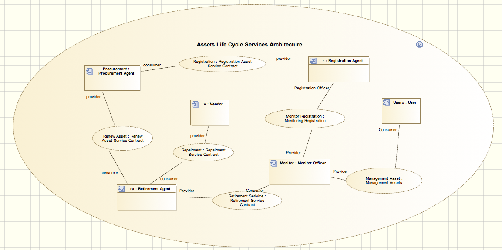

Diatas adalah gambaran umun secara keseluruhan service architecture sistem asset life cycle, dapat dilihat siklusnya, dan beberapa hubungan dengan partisipan luar seperti vendor, user dan procurement. Siklus dimulai dari pengadaan barang oleh procurement yang diregistrasi, dicek, dan dialokasikan pada service register, lalu setelah itu masuk ke bagian monitor dari aset aset yang telah terdaftar, bagian ini berhubungan dengan user secara timbal balik. Ketika ada laporan rusak, siklus berlanjut ke proses retirement dan di tahap ini akan diputuskan apakah aset harus diganti baru atau masih bisa di perbaiki, jika dilakukan pembelian aset baru maka siklus akan berulang ke procurement.

### Registration Asset Capability Diagram 
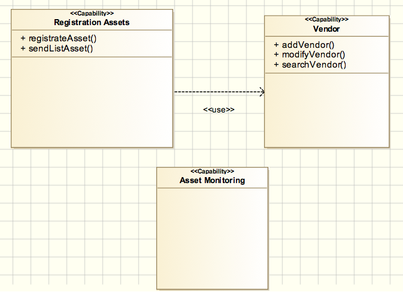

Diagram ini menunjukkan kemampuan yang dimiliki oleh Registration Asset Service. Kemampuan utama dari service ini adalah melakukan pendataan terhadap aset baru. Service ini menggunakan Vendor untuk melakukan:
1. Penambahan data vendor jika ternyata penyedia barang belum tersedia
2. Pengubahan data vendor jika diketahui terjadi perubahan
3. Pencarian vendor.

### Registration Asset Service Contract Diagram
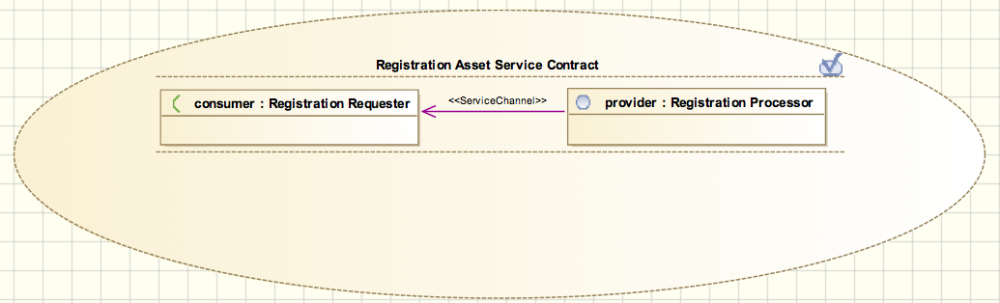

Diagram ini menggambarkan kontrak yang dimiliki antara participant Registration Agent dan Renew (Procurement) Agent. Pada participant Registration Agent terdapat interface bernama Registration Processor yang bertindak sebagai service provider, sedangkan pada participant Renew (Procurement) Agent terdapat interface yang bernama Registration Requester yang bertindak sebagai consumer. 

Registration Requester bertugas untuk melakukan permintaan pendataan terhadap aset baru yang dilakukan oleh Renew (Procurement) Agent. Fungsi Registration Agent adalah memproses request yang dikirimkan melalui interface Renew Processor.
	
### Registration Asset Participant Diagram
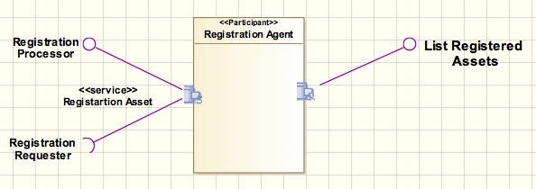

Diagram ini menggambarkan keterlibatan participant Registration Agent terhadap service-service yang digunakan atau disediakan. Participant ini menyediakan satu buah service, yaitu Registration Asset Service.

### Registration Asset Interface Diagram 
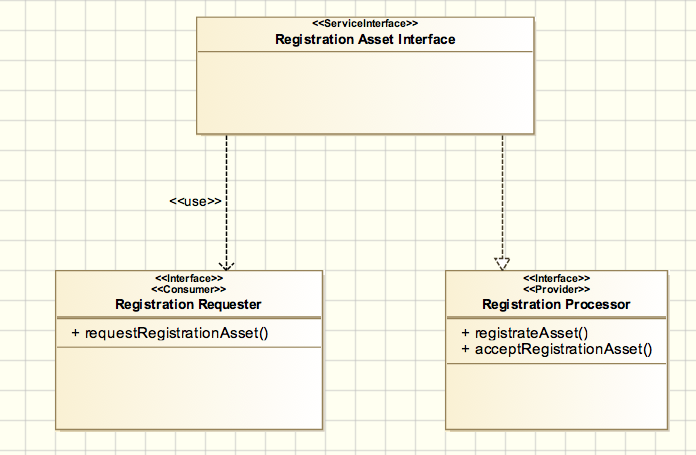

Diagram ini menggambarkan interface yang terdapat pada service contract Registration Asset. Terdapat dua buah interface, yaitu Registration Requester yang merupakan consumer dan Registration Processor yang bertindak sebagai provider. Masing-masing service mempunyai operasi/method yang berkorelasi. Consumer akan memanggil method requestRegistrationAsset kemudian method acceptRegistrationAsset dan registrateAsset akan diinvoke pada sisi provider.

### Registration Asset Message Diagram 
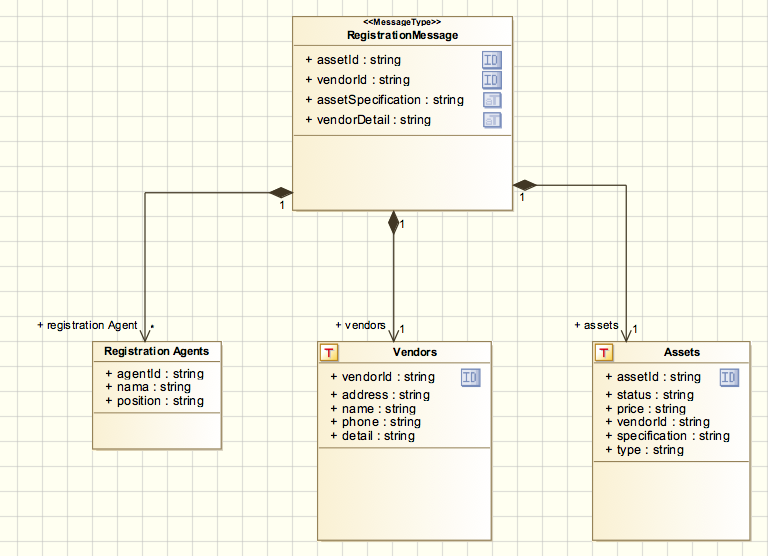

Diagram ini menggambarkan aliran pesan yang terjadi ketika Procurement Agent menggunakan service Registration Asset. Properties dari Procurement Agent yang memanggil service akan dicatat dan identitas aset yang baru saja dibeli (assetId), identitats vendor (vendorId), spesifikasi asset(assetSpecification), dan detail vendor (vendorDetail) akan dibentuk sebuah message yang bernama RegistrationMessage. Hasil dari pemrosesan ini akan memberikan data yang bertipe Assets dan Vendors. Tipe data Assets digunakan untuk menyimpan data terkait aset, sedangkan tipe data Vendors digunakan untuk meyimpan data terkait penyedia barang.

### Monitoring Capability Diagram
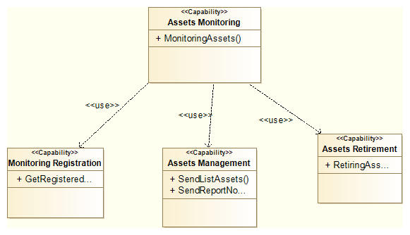	

Diagram ini menunjukkan kemampuan yang dimiliki oleh services assets monitoring. Kemampuan utama dari service ini ialah memonitoring, yang selanjutnya di pecah menjadi 3 bagian:
1. Monitoring Registration: Memonitor hasil asset yang telah di registrasi, dengan mendapatkan list dari service registrasi.
2. Assets Management: Memiliki 2 fungsi yakni mengirimkan list asset sesuai permintaan user dan menghandle report asset dari user.
3. Assets Retirement: Memiliki fungsi untuk menghapus atau mengganti aset yang tidak layak.

### Monitoring Participant Diagram
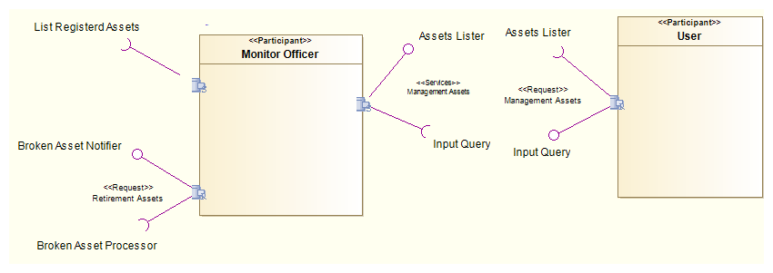

Pada diagram ini terdapat dua partisipan dalam service ini, yakni partisipan dalam yakni user dan partisipan dari luar yakni user, user dapat berupa sistem lain ataupun orang. lalu ada juga monitor officer yang menghandel service yang disediakan oleh monitor service. user memiliki satu port request sedangkan monitor officer memiliki 2 service dan 1 request.

### Management Assets Service Contract Diagram
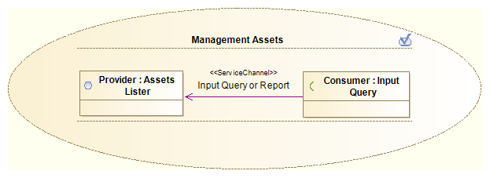

Diagram di atas menunjukkan tentang service kontrak antara partisipant user dan partisipant monitor officer. management asset memperlihatkan proses service untuk report dan mencari asset. intinya user dapa yang di diagram ini direpresentasikan ke dalam interfacenya yakni input query, dan berlaku sebagai consumer. Monitor officer sebagai provider dengan interface assets lister.
	
### Management Assets Service Interface Diagram
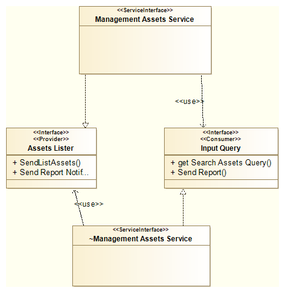

Diagram diatas menjelaskan tentang service interface pada service contract management service. yang atas ialah provider, di pakai pada port monitor officer dan yang bawah ialah consumer dipakai oleh port user.

### Management Assets Message Diagram
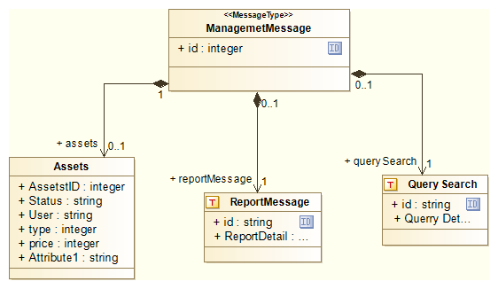

Pada gambar diatas ialah message yang digunakan dalam service management asset, Message yang dipakai oleh service ini bisa hanya report asset atau tentang permintaan sebuah list aset. oleh karena itu kelas aset dimasukkan.

### Monitoring Registration Service Contract Diagram
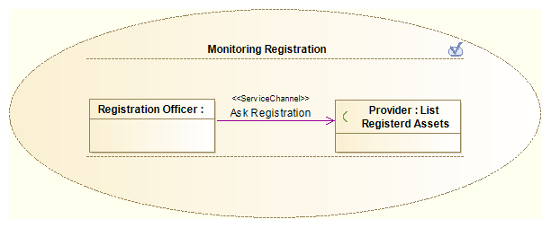

Monitor Registration initinya ialah memberikan list aset yang telah diregistrasi kepada monitor officer yang manifestasinya berupa service interface list registerd assets.
	

### Monitoring Registration Service Interface Diagram
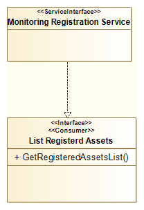

Implementasi dari interface monitoring registration yakni mendapatkan list aset aset baru yang telah teregistrasi dan otomatis telah dialokasi.

### Monitoring Registration Message Diagram15. 
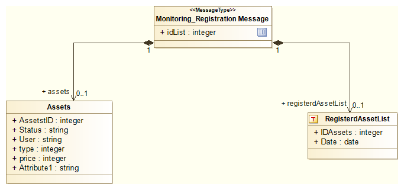

Karena berhubungan dengan aset maka kelas aset dihubungkan, dan message ini berisi list dari asset baru yang telah diregistrasi. tiap list memiliki id sendiri-sendiri.
 
### Retirement Service Contract Diagram
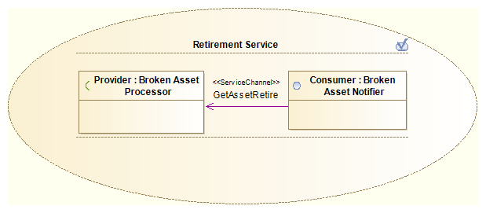

Diagram ini merupakan bagian request dari service yang terdapat pada retirement asset. dari sisi monitoring memberikan notifikasi barang yang rusak dan akan menunggu hasil pemrosesan barang yang rusak tersebut.

### Retirement Service Interface Diagram
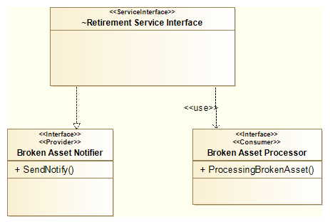
	
Ini berupakan potongan dari Interface diagram Retirement Service. pada diagram ini menunjukkan bahwa request mengimlementasikan fungsi sendnotify dari profider dan membutuhkan fungsi pemrosesan aset rusak dari consumer.

### Retirement Agent Capability Diagram
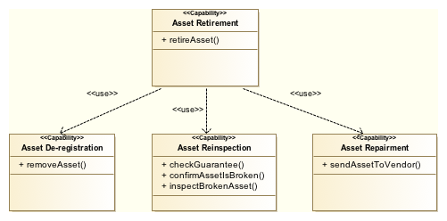
	
Diagram ini menunjukkan kemampuan yang dimiliki oleh retirement agent, yaitu untuk memensiunkan sebuah aset (Asset Retirement). Dalam prosesnya, untuk memensiunkan aset dibutuhkan kemampuan-kemampuan lain, yaitu: 
Asset De-registration	: penghapusan aset dari daftar aset
Asset Reinspection	: pengecekan apakah aset yang rusak masih memungkinkan untuk diperbaiki
Asset Repairment	: perbaikan aset dengan mengirimkan aset ke vendor

### Retirement Agent Participant Diagram
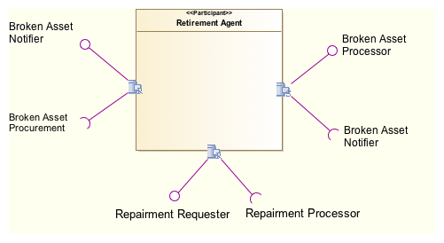
	
Diagram ini menggambarkan keterlibatan participant Retirement Agent terhadap service-service yang digunakan atau disediakannya. Participant ini menyediakan satu buah service, yaitu Broken Asset Processor dan mengkonsumsi dua buah service Repairment Requester dan Broken Asset Procurement.

### Retirement Service Contract Diagram
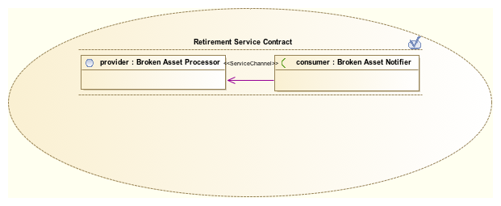
	
Diagram ini menggambarkan kontrak yang dimiliki antara participant Retirement Agent dan Monitoring Agent. Pada participant Retirement Agent terdapat interface bernama Broken Asset Processor yang bertindak sebagai service provider, sedangkan pada participant Monitoring Agent terdapat interface yang bernama Broken Asset Notifier yang bertindak sebagai consumer. 

Pada dasarnya Broken Asset Notifier bertugas untuk memberitahu kepada Retirement Agent melalui interface Broken Asset Processor jika ada aset yang rusak. Selain itu, Broken Asset Notifier juga akan memanggil service yang berkaitan melalui interface Broken Asset Processor untuk melakukan perbaikan pada aset.

### Retirement Service Interface Diagram
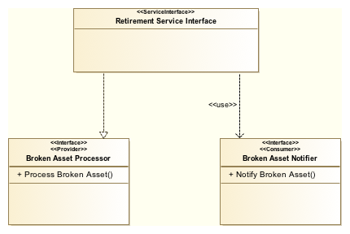
	
Diagram ini menggambarkan interface yang terdapat pada service contract Retirement. Terdapat dua buah interface, yaitu Broken Asset Processor yang merupakan provider dan Broken Asset Notifier yang bertindak sebagai consumer. Masing-masing service mempunyai operasi/method yang berkorelasi. Konsumer akan memanggil method Notify Broken Asset maka method Process Broken Asset akan di invoke pada sisi provider.

### Retirement Message Diagram
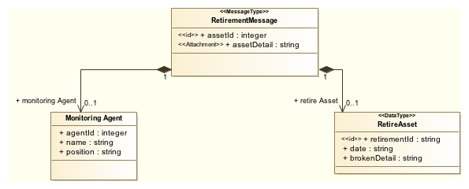
	
Diagram ini menggambarkan aliran pesan yang terjadi ketika participant Monitoring Agent menggunakan service Retirement. Properties dari Monitoring Agent yang menggunakan service akan dicatat dan data-data aset yang rusak akan dikirimkan ke Retirement Agent dengan tipe message yang bernama RetirementMessage. Hasil dari pemrosesan ini akan memberikan data yang bertipe RetireAsset.

### Repairment Service Contract Diagram
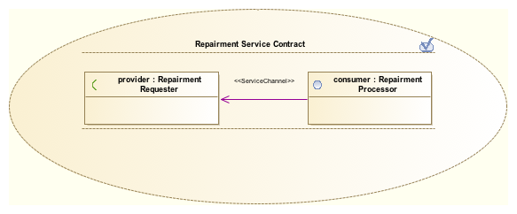
	
Diagram ini menggambarkan kontrak yang dimiliki antara participant Retirement Agent dan participant eksternal, yaitu Vendor. Vendor disini merupakan perusahaan yang melakukan reparasi dari aset yang rusak. Pada participant Retirement Agent terdapat interface bernama Repairment Requester yang bertindak sebagai service consumer, sedangkan pada participant Vendor terdapat interface yang bernama Repairment Processor yang bertindak sebagai provider. 

Pada dasarnya Repairment Requester bertugas untuk memberitahu kepada Vendor melalui interface Repairment Processor jika ada aset yang rusak. Selain itu, Repairment Requester juga akan memanggil service yang berkaitan melalui interface Repairment Processor untuk melakukan perbaikan pada aset.

### Repairment Service Interface Diagram
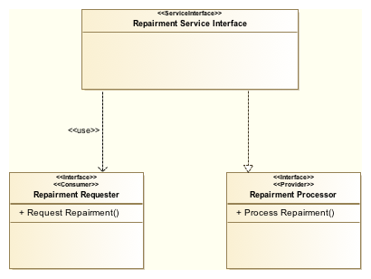
	
Diagram ini menggambarkan interface yang terdapat pada service contract Repairment. Terdapat dua buah interface, yaitu Repairment Reqiester yang merupakan consumer dan Repairment Processor yang bertindak sebagai provider. Masing-masing service mempunyai operasi/method yang berkorelasi. Konsumer akan memanggil method Request Retirement pada dirinya maka kemudian method Process Repairment akan di invoke pada sisi provider.

### Repairment Message Diagram
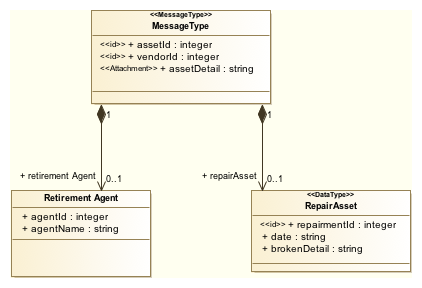
	
Diagram ini menggambarkan aliran pesan yang terjadi ketika participant Retirement Agent menggunakan service Repairment. Properties dari Retirement Agent yang memanggil service akan dicatat dan detail serta vendor aset  yang rusak akan dikirimkan ke Vendor terkait dengan tipe message yang bernama RepairmentMessage. Hasil dari pemrosesan ini akan memberikan data yang bertipe RepairAsset.

### Renew Aset (Procurement) Capability Diagram
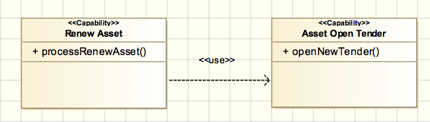
 
Diagram ini menunjukkan kemampuan yang dimiliki oleh Renew Asset Agent (Procurement Agent), yaitu terkait pengadaan sebuah aset. Dalam prosesnya,pengadaan barang akan melibatkan:
Asset Open Tender	: pembukaan lelang kepada vendor yang merasa memiliki aset yang dibutuhkan 

### Renew Aset (Procurement) Participant Diagram
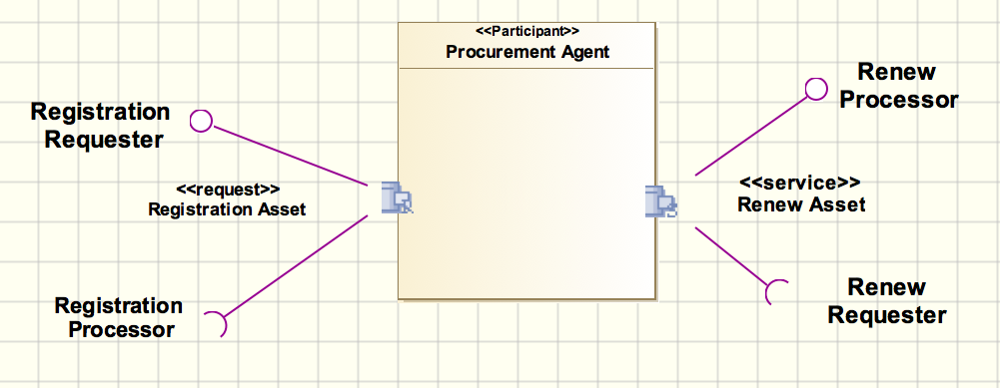

Diagram ini menggambarkan keterlibatan participant Procurement Agent terhadap service-service yang digunakan atau disediakannya. Participant ini menyediakan satu buah service, yaitu Renew Asset Service dan menggunakan satu buah service, yaitu Registration Asset Service.

### Renew Aset (Procurement) Service Contract
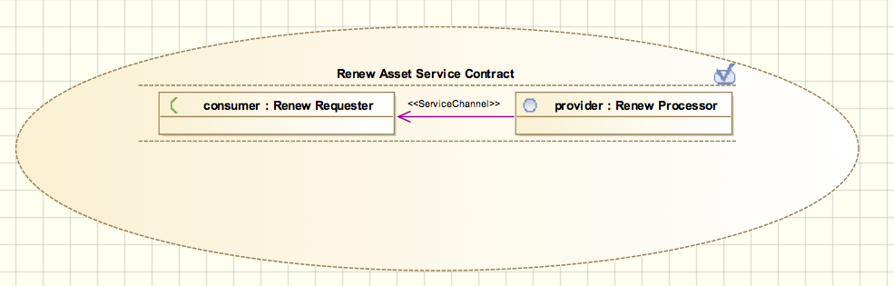

Diagram ini menggambarkan kontrak yang dimiliki antara participant Retirement Agent dan Renew (Procurement) Agent. Pada participant Retirement Agent terdapat interface bernama Renew Requester yang bertindak sebagai service consumer, sedangkan pada participant Renew (Procurement) Agent terdapat interface yang bernama Renew Processor yang bertindak sebagai provider. 

Renew Requester bertugas untuk melakukan permintaan pengadaan aset baru yang dilakukan oleh Retirement Agent kepada Renew (Procurement) Agent yang dimana interface Renew Processor berfungsi untuk memproses request yang dikirimkan.

### Renew Aset (Procurement) Interface Diagram
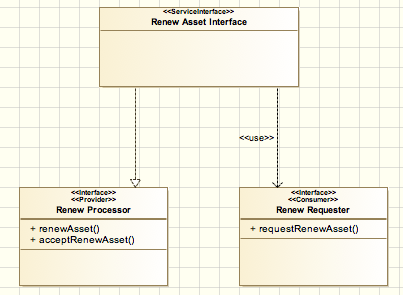

Diagram ini menggambarkan interface yang terdapat pada service contract Renew (Procurement). Terdapat dua buah interface, yaitu Renew Register yang merupakan consumer dan Renew Processor yang bertindak sebagai provider. Masing-masing service mempunyai operasi/method yang berkorelasi. Consumer akan memanggil method requestRenewAsset() kemudian method acceptRenewAsset dan renewAssetakan akan diinvoke pada sisi provider.
	
### Renew Aset (Procurement) Message Diagram
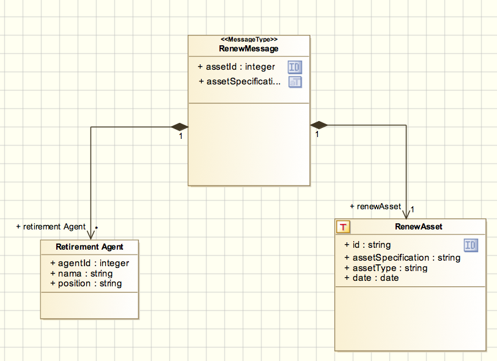

Diagram ini menggambarkan aliran pesan yang terjadi ketika participant Retirement Agent menggunakan service Renew Asset. Properties dari Retirement Agent yang memanggil service akan dicatat dan identitas aset yang rusak (assetId) serta spesifikasi asset yang dinginkan (assetSpecification) akan dibentuk sebuah message yang bernama RenewMessage. Hasil dari pemrosesan ini akan memberikan data yang bertipe RenewAsset.

